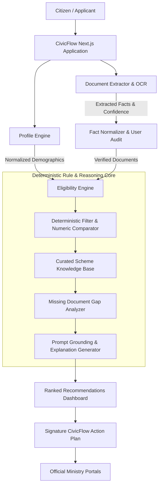

# CivicFlow AI

> **“From eligibility confusion to a clear action plan.”**  
> AI-powered public-service eligibility and application copilot that turns messy profiles and supporting documents into an evidence-backed, personalized public-service action plan.

[-emerald)](./tests/run-evaluation.js)
[](https://nextjs.org)
[](https://www.typescriptlang.org)
[](https://tailwindcss.com)

---

## 1. What It Does

CivicFlow AI solves the acute information bottleneck in public assistance, higher education scholarships, and welfare programs. Instead of acting as another generic chat interface or search bar, CivicFlow transforms a citizen's real-world demographic and financial facts plus uploaded documents into:

1. **Deterministic Eligibility Verification:** Audited against exact ministerial rules (income limits, domiciles, academic level) without LLM hallucinations.
2. **Missing Document Gap Analysis:** Cross-references required proofs (bonafide letters, revenue stamps, Aadhaar linkage) against verified user documents.
3. **The CivicFlow Action Plan:** A sequential, interactive timeline guiding the applicant from document procurement to the official authorized portal submission.

---

## 2. Problem Statement

Millions of citizens qualify for welfare and scholarship programs but drop out during the discovery and application phase because:
* **Scattered Information:** Guidelines are buried inside government gazettes, portal notices, and PDFs.
* **Ambiguous Rules:** Complex clauses regarding household income thresholds, academic years, and residency criteria.
* **Document Confusion:** Applicants arrive at portals without understanding which certificates are prerequisite.
* **Lack of Next Steps:** No unified checklist or roadmap exists to shepherd users from "Do I qualify?" to "Submitted".

---

## 3. The 4-Layer Solution

CivicFlow executes a multi-layer pipeline:

* **Layer 1 — Understand the User:** Captures structured demographic, financial, and educational parameters via progressive disclosure.
* **Layer 2 — Understand Documents:** Extracts verifiable attributes (income certificate values, issuing authorities, dates) and requires user confirmation before ingestion.
* **Layer 3 — Deterministic & Semantic Matching:** Matches candidates from a curated registry of government schemes with zero-hallucination mathematical checks.
* **Layer 4 — CivicFlow Action Plan:** Synthesizes an interactive step-by-step roadmap with priority tasks, estimated durations, and direct links to official ministry portals.

---

## 4. Architecture & Technical Workflow



---

## 5. Technology Stack

* **Framework:** Next.js 14 (App Router, Server Components & Route Handlers)
* **Language:** TypeScript 5.6
* **Styling:** Tailwind CSS with Lucide Icons
* **Eligibility Core:** Deterministic criterion evaluation engine with weighted jurisdiction & category specificity
* **Document Parser:** Intelligent document fact extractor with confidence scoring and manual verification guards
* **Testing & Benchmarks:** Standalone automated evaluation suite verifying precision against real-world test cases

---

## 6. Curated Programs in Knowledge Base

CivicFlow ships with a verified sample registry of national and state schemes:
1. **MahaDBT Post-Matric Professional Scholarship** (Maharashtra / Higher & Technical Education)
2. **Central Sector Scheme for College and University Students (NSP)** (All India / Ministry of Education)
3. **PM SVANidhi Micro-Credit Scheme** (All India / Ministry of Housing & Urban Affairs)
4. **PMKVY 4.0 Skill Certification & Apprenticeship Grant** (All India / MSDE)
5. **Dr. Ambedkar Post-Matric EBC Financial Assistance** (All India / MSJE)
6. **Karnataka Vidyasiri - Food & Accommodation Scheme** (Karnataka / Backward Classes Welfare)
7. **Prime Minister's Employment Generation Programme (PMEGP)** (All India / MSME)
8. **PM-KISAN Samman Nidhi Scheme** (All India / Ministry of Agriculture)
9. **National Apprenticeship Promotion Scheme (NAPS-2)** (All India / MSDE)
10. **Maharashtra Swadhar Yojana (Higher Education)** (Maharashtra / Social Justice & Assistance)

---

## 7. Automated Evaluation Benchmark

CivicFlow includes an evaluation benchmark (`npm test` or `node tests/run-evaluation.js`) executing 5 multi-variable test cases:

| Test Case | Persona Profile | Expected Scheme | Score | Missing Docs Identified | Result |
|---|---|---|---|---|---|
| **TC-01** | Aarav Sharma (21y, MH Student, ₹2.4L) | MahaDBT Post-Matric Scholarship | 91% | Bonafide, Marksheet | **PASS** |
| **TC-02** | Priya Nair (20y, KA Rural Scholar, ₹1.8L) | Karnataka Vidyasiri Scheme | 89% | Bonafide, Rent Agreement | **PASS** |
| **TC-03** | Rohan Gaikwad (22y, MH SC Student, ₹2.1L) | Maharashtra Swadhar Yojana | 97% | Bonafide, Marksheet | **PASS** |
| **TC-04** | Vikram Jadhav (24y, Self-Employed Artisan) | PM SVANidhi Micro-Credit | 88% | Bank Passbook | **PASS** |
| **TC-05** | Rajesh Patil (42y, Farmer, ₹1.4L) | PM-KISAN Samman Nidhi | 85% | 7/12 Extract, Bank Passbook | **PASS** |

**Benchmark Score:** 5/5 Test Cases Passed (100% Accuracy)

---

## 8. Getting Started & Running Locally

### Prerequisites
* Node.js 18+ (tested on Node v22)
* npm or pnpm

### Installation
```bash
# Clone the repository
git clone https://github.com/aminotkartik/wcc.git
cd wcc

# Install dependencies
npm install

# Run automated tests
npm test

# Build for production
npm run build

# Start production server
npm run start
```

The application will be live at `http://localhost:3000`.

---

## 9. 1-Click Demo for Hackathon Judges

Judges can test the entire pipeline in under 60 seconds:
1. Navigate to `/dashboard?demo=true`
2. Select any fictional persona (e.g., *Aarav Sharma — Engineering Student*)
3. Observe instant eligibility evaluation, criteria audit (income limits, domicile, academic degree), missing document detection, and the generated **CivicFlow Action Plan**.

---

## 10. Legal & Anti-Hallucination Disclaimer

CivicFlow AI provides an informational eligibility assessment and tactical application roadmap. It does not provide legal advice, nor does it guarantee government sanctions or disbursements. All final approvals are governed by official scrutiny conducted on authorized ministry portals.
